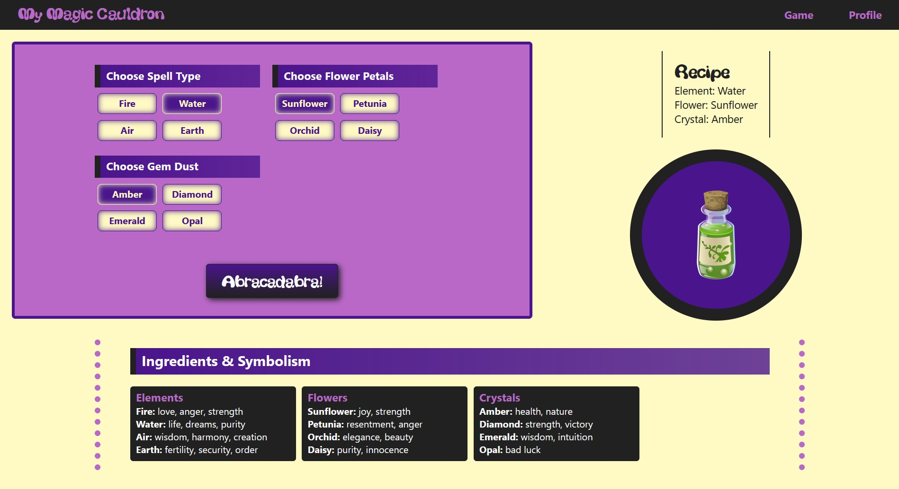
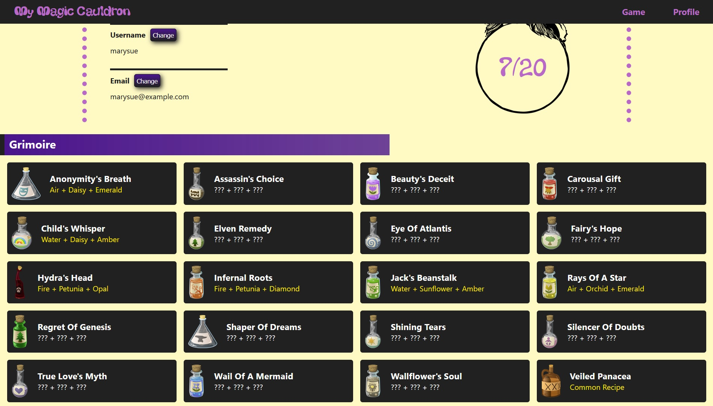

# My Magic Cauldron

 The objective in My Magic Cauldron is to create magic potions by combining different ingredients. It is a simple web app that allows the user to experiment with different recipes and sign up to keep track and learn more about the potions they made.
 The website can be found [here](https://my-magic-cauldron.herokuapp.com/).

## Project Details

* Front-End: React - JavaScript for the logic, CSS for UI styling
* Back-End: Node.js and Express.js for the creation of a web server and connection to the database, PostgreSQL for database management